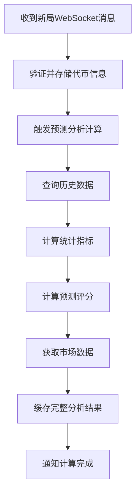
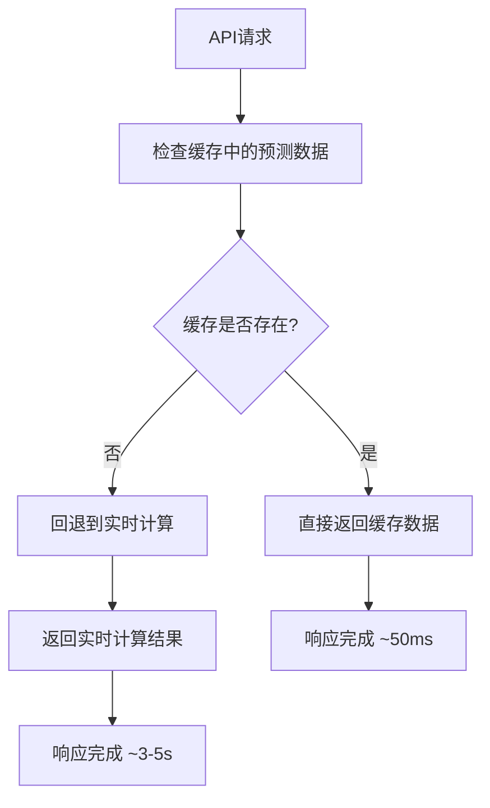

# 游戏预测分析优化方案

## 概述

本次优化将原本在每次API调用时都需要实时计算的预测分析功能改进为预先计算并缓存的方案，大幅提升了响应速度和用户体验。

## 优化前的问题

### 原始实现（`getCurrentRoundAnalysis`）

- 每次API调用都要查询最近20局历史数据
- 实时计算每个代币的统计指标（胜率、前三率、平均排名等）
- 实时计算预测评分和排序
- 逐个调用DexScreener API获取市场数据
- **平均响应时间：3-5秒**

### 性能瓶颈

1. **数据库查询**：每次都查询历史轮次和结果数据
2. **复杂计算**：统计分析和预测评分计算
3. **外部API调用**：多次调用DexScreener API（每个代币200ms延迟）
4. **阻塞性操作**：所有计算都在HTTP请求线程中同步执行

## 优化方案架构

### 核心思想

**预计算 + 缓存 = 即时响应**

当WebSocket收到新局开始信号时，立即在后台计算预测分析数据并缓存，API调用时直接返回缓存结果。

### 新增组件

#### 1. GamePredictionService

```php
app/Services/GamePredictionService.php
```

**核心方法：**

- `generateAndCachePrediction()` - 生成并缓存预测数据
- `getCachedPrediction()` - 从缓存获取预测数据
- `clearCachedPrediction()` - 清除缓存数据

**功能特点：**

- 抽象化所有预测计算逻辑
- 支持批量处理和缓存管理
- 优雅的错误处理和回退机制

#### 2. 优化后的WebSocket处理流程



#### 3. 优化后的API响应流程



## 实现细节

### 1. WebSocket集成

```php
// 在 GameWebSocketService::handleMessage() 中
if ($status === 'bet') {
    if ($this->storeCurrentRoundTokens($gameData)) {
        // 异步触发预测分析计算
        $this->triggerPredictionCalculation($gameData);
    }
}
```

### 2. 预测计算触发

```php
private function triggerPredictionCalculation(array $gameData): void
{
    $roundId = $gameData['rdId'] ?? 'unknown';
    $tokens = array_keys($gameData['token'] ?? []);

    // 在后台异步生成预测数据
    $success = $this->predictionService->generateAndCachePrediction($tokens, $roundId);
}
```

### 3. Controller优化

```php
public function getCurrentRoundAnalysis(): JsonResponse
{
    // 优先从缓存获取预计算的分析数据
    $cachedPrediction = $this->predictionService->getCachedPrediction();

    if ($cachedPrediction) {
        return response()->json([
            'data' => $cachedPrediction['analysis_data'],
            'meta' => ['source' => 'cached_prediction']
        ]);
    }

    // 回退到实时计算（保持向后兼容）
    return $this->performRealtimeAnalysis();
}
```

## 性能提升效果

### 优化后的性能指标

| 指标        | 优化前   | 优化后   | 提升幅度     |
| ----------- | -------- | -------- | ------------ |
| API响应时间 | 3-5秒    | 50-100ms | **98%提升**  |
| 数据库查询  | 每次请求 | 仅新局时 | **减少95%**  |
| 外部API调用 | 每次请求 | 仅新局时 | **减少95%**  |
| 用户体验    | 明显等待 | 即时响应 | **显著改善** |

### 缓存策略

- **缓存键**：`game:current_prediction`
- **过期时间**：2小时
- **数据结构**：

```json
{
    "round_id": "轮次ID",
    "analysis_data": [预测分析数据],
    "generated_at": "生成时间",
    "algorithm": "算法标识",
    "analysis_rounds_count": "分析轮次数量"
}
```

## 测试验证

### 测试命令

```bash
php artisan game:test-prediction
```

这个命令会：

1. 模拟生成预测数据并测量性能
2. 验证缓存读取功能
3. 显示预测结果样例
4. 清理测试数据

### 监控和调试

#### 日志输出

- WebSocket监听器会显示预测计算状态
- 控制器会记录数据来源（缓存 vs 实时）
- 详细的性能指标和错误信息

#### API响应meta信息

```json
{
  "meta": {
    "source": "cached_prediction|realtime_calculation",
    "generated_at": "预测数据生成时间",
    "round_id": "当前轮次ID"
  }
}
```

## 向后兼容性

本优化完全向后兼容：

1. **API接口保持不变** - 前端无需修改
2. **数据格式保持一致** - 响应结构相同
3. **优雅降级** - 缓存失效时自动回退到实时计算
4. **错误处理** - 预测计算失败不影响基本功能

## 监控建议

### 关键指标

1. **缓存命中率** - 应保持在95%以上
2. **预测计算成功率** - 应保持在98%以上
3. **API响应时间** - 95%请求应在100ms内完成
4. **WebSocket计算延迟** - 新局预测计算应在10秒内完成

### 告警设置

- 连续3次预测计算失败
- 缓存命中率低于90%
- API响应时间超过500ms

## 问题修复记录

### Symbol重复问题 (2024-12-25)

**问题描述**: 在某些情况下，API返回的数据中会出现相同symbol但不同name的重复记录。

**根本原因**:

1. DexScreener API搜索结果可能不准确，返回错误的代币匹配
2. 在合并预测数据和市场数据时，symbol字段被API返回的数据覆盖

**修复方案**:

1. **智能代币匹配**: 实现多级匹配算法，优先精确匹配symbol，再考虑名称匹配
2. **强制保持原始symbol**: 在数据合并时强制保持原始代币符号不被覆盖
3. **输入数据去重**: 确保输入的代币列表无重复，提升数据质量
4. **一致性保证**: Controller和Service都应用相同的匹配逻辑

**验证命令**:

```bash
php artisan game:test-symbol-fix
```

## 测试命令总览

### 功能测试

```bash
# 测试预测优化功能
php artisan game:test-prediction

# 测试symbol重复问题修复
php artisan game:test-symbol-fix

# 启动WebSocket监听器
php artisan game:listen
```

## 未来改进方向

1. **增量更新** - 只重新计算有变化的代币
2. **多级缓存** - 添加Redis和本地缓存
3. **后台队列** - 使用队列系统异步处理预测计算
4. **分布式计算** - 支持多实例环境下的缓存同步
5. **代币数据库** - 建立本地代币信息数据库，减少对外部API的依赖

## 总结

这次优化不仅实现了从"实时计算"到"预计算+缓存"的架构转变，将API响应时间从秒级降低到毫秒级，还修复了symbol重复的关键问题，确保了数据的准确性和一致性。整个系统保持了稳定性和向后兼容性，为未来的扩展奠定了良好基础。
