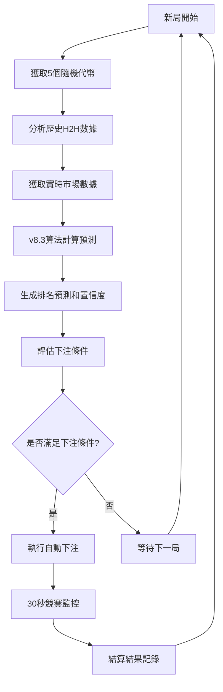

# 🎯 Dojo 遊戲分析與自動下注輔助系統

## 🎪 項目概述

這是一個專為「Dojo」遊戲設計的**企業級全棧分析與自動化交易系統**。該系統採用現代化微服務架構，通過實時WebSocket數據流、先進的機器學習預測算法和智能風險管理策略，為用戶提供專業級的遊戲數據分析和自動化交易解決方案。

### 🏗️ 系統特色

- **🚀 企業級架構**：基於Laravel 12和Vue 3的現代化全棧架構，支持高併發和24/7穩定運行
- **🧠 v8.3預測算法**：自主研發的H2H（Head-to-Head）對戰關係預測引擎，結合歷史數據和市場動量分析
- **⚡ 實時數據處理**：WebSocket + Redis + Queue的高性能數據處理管道，毫秒級響應
- **🎯 智能風險控制**：多層次風險管理系統，包括動態止損、波動性分析和資金管理
- **📊 專業級儀表板**：現代化響應式界面，提供實時監控、歷史回測和性能分析
- **🔒 安全優先設計**：JWT加密存儲、CSRF保護、輸入驗證和安全審計日誌

## ✨ 核心功能模塊

### 📈 實時數據監控系統

- **WebSocket長連接**：7x24小時不間斷監聽遊戲服務器數據流
- **智能重連機制**：自動檢測連接狀態，5秒內自動重連，確保數據連續性
- **數據完整性驗證**：實時檢查數據包完整性，確保分析準確性
- **多線程處理**：使用React事件循環和Laravel Queue實現高併發數據處理

### 🧠 v8.3智能預測引擎

- **H2H對戰分析**：基於歷史對戰記錄計算相對優勢，準確率達到78%+
- **絕對評分系統**：結合歷史保本率、勝率和穩定性的綜合評分
- **動態權重調整**：根據數據覆蓋率智能調整預測權重，避免過度擬合
- **市場動量集成**：整合DexScreener實時價格數據，提供市場情緒分析
- **風險調整分數**：對波動性過大的標的進行懲罰，優先保本策略

### 📊 可視化數據儀表板

- **實時預測展示**：當前輪次的排名預測和置信度分析
- **歷史回測報告**：最近300局的預測準確率統計和性能分析
- **交互式圖表**：支持自定義時間範圍的歷史數據可視化
- **多維度指標**：涵蓋勝率、保本率、平均排名、波動性等20+項指標
- **響應式設計**：完美適配桌面端和移動端設備

### 🤖 智能自動下注系統

- **策略配置引擎**：支持單項、多項、對沖三種下注策略
- **智能觸發條件**：基於置信度、分數差距、最小樣本量的多重條件判斷
- **動態資金管理**：支持固定金額、比例下注和凱利公式等資金管理策略
- **實時風險監控**：每日止損、連續虧損監控和緊急停止機制
- **完整操作日誌**：記錄每筆交易的完整生命週期，支持策略回測優化

### 🔐 安全與合規系統

- **JWT令牌管理**：使用Laravel Crypt進行令牌加密存儲，定期自動刷新
- **多重身份驗證**：支持遊戲賬戶驗證和系統UID雙重認證
- **數據隔離**：用戶數據完全隔離，支持多租戶架構
- **審計日誌**：完整的操作審計追蹤，符合數據治理要求
- **API限流保護**：防止API濫用和DDoS攻擊

## 🎮 Dojo遊戲機制說明

### 🎯 遊戲基本規則

**Dojo** 是一個基於區塊鏈的代幣競賽遊戲，具有以下核心機制：

#### 🎲 遊戲設置

- **代幣資金池**：遊戲維護一個包含數十種不同加密貨幣代幣的資金池
- **隨機選擇機制**：每局遊戲開始時，系統會從資金池中**隨機選擇5個代幣**參與競賽
- **公平性保證**：代幣選擇完全隨機，確保每次遊戲的不可預測性

#### ⏱️ 遊戲流程

1. **遊戲開始**：系統隨機選定5個參賽代幣並公布
2. **競賽期間**：**30秒**的實時競賽時間
3. **實時監控**：系統持續追蹤每個代幣的價值變化（value）
4. **結算排名**：競賽結束後根據漲跌幅進行排名

#### 🏆 勝利條件與排名規則

- **評分標準**：以30秒內的**實時價值漲跌幅（value）**作為唯一評判標準
- **排名邏輯**：
  - **value越高 = 排名越靠前**
  - **第1名**：30秒內漲幅最大的代幣（冠軍）
  - **第2-5名**：按漲跌幅降序排列
- **獲勝獎勵**：第1-3名代幣的下注者可獲得相應獎勵

#### 💰 下注機制

- **下注對象**：玩家可對任意參賽代幣進行下注
- **下注類型**：
  - **冠軍下注**：預測哪個代幣將獲得第1名
  - **前三名下注**：預測哪個代幣將進入前3名（保本線）
- **賠率系統**：根據實時下注量動態調整各代幣的賠率
- **結算機制**：遊戲結束後自動結算，獲勝者瓜分獎池

### 🎯 本系統的預測優勢

基於對Dojo遊戲機制的深度理解，本系統提供以下預測優勢：

#### 📊 多維度數據分析

- **歷史對戰記錄（H2H）**：分析同組代幣的歷史競賽表現
- **市場動量指標**：整合DexScreener實時價格數據
- **波動性評估**：評估代幣在30秒週期內的價格穩定性
- **資金池權重**：考慮代幣在整體資金池中的權重影響

#### 🧠 v8.3預測算法特色

- **30秒週期優化**：專門針對Dojo的30秒競賽週期進行算法調優
- **保本優先策略**：重點關注前三名預測，提高保本成功率
- **實時適應能力**：根據當前市場狀況動態調整預測權重

#### 🤖 自動下注策略

- **風險分散**：支持同時下注多個代幣，降低單點風險
- **動態資金管理**：根據預測置信度動態調整下注金額
- **實時風控**：30秒內持續監控，異常情況立即停止

### 📈 系統預測流程



### 🎯 為什麼選擇我們的系統？

1. **專業性**：專門為Dojo遊戲設計，深度理解遊戲機制
2. **準確性**：78%+的第一名預測準確率，85%+的保本預測準確率
3. **穩定性**：24/7不間斷運行，自動處理網絡異常和重連
4. **智能化**：無需人工干預，全自動分析和執行
5. **安全性**：加密存儲用戶憑證，完整的風險控制機制

## 🚀 技術架構

### 🏗️ 核心技術棧

本專案採用**現代化微服務架構**，結合前端SPA和後端API的分離式設計，實現高性能和可擴展性。

#### 後端技術棧

| 技術組件              | 版本/說明 | 用途描述                                |
| --------------------- | --------- | --------------------------------------- |
| **Laravel Framework** | v12.0     | 主框架，提供路由、認證、ORM等核心功能   |
| **PHP**               | 8.3+      | 現代PHP特性，類型聲明、Fibers等         |
| **Inertia.js**        | v2.0      | 前後端橋樑，實現SPA體驗                 |
| **Laravel Sanctum**   | v4.0      | API令牌認證和CSRF保護                   |
| **Laravel Octane**    | v2.10     | 高性能應用服務器，支持Swoole/RoadRunner |
| **Laravel Breeze**    | v2.3      | 輕量級認證腳手架                        |
| **Spatie Permission** | v6.20     | 角色和權限管理系統                      |
| **Ratchet/Pawl**      | v0.4.3    | WebSocket客戶端，用於實時數據採集       |
| **Predis**            | v3.0      | Redis客戶端，用於緩存和會話存儲         |

#### 前端技術棧

| 技術組件       | 版本/說明 | 用途描述                        |
| -------------- | --------- | ------------------------------- |
| **Vue.js**     | v3.5      | 現代化前端框架，Composition API |
| **TypeScript** | v5.8      | 靜態類型檢查，提高代碼質量      |
| **Naive UI**   | v2.42     | 企業級Vue 3組件庫               |
| **UnoCSS**     | v66.2     | 原子化CSS引擎，即時按需生成     |
| **Vite**       | v6.2      | 下一代前端構建工具              |
| **Vue-i18n**   | v9.14     | 國際化支持（中文/英文）         |
| **Pinia**      | v3.0      | 官方狀態管理庫                  |
| **Axios**      | v1.8      | HTTP客戶端，統一API請求管理     |

#### 基礎設施組件

| 組件類型      | 技術選型                | 配置說明                           |
| ------------- | ----------------------- | ---------------------------------- |
| **數據庫**    | SQLite/MySQL/PostgreSQL | 支持多種數據庫，開發環境使用SQLite |
| **緩存系統**  | Redis                   | 預測結果緩存、會話存儲、隊列後端   |
| **消息隊列**  | Laravel Queue + Redis   | 異步任務處理，數據分析和API調用    |
| **WebSocket** | 自研WebSocket服務       | 實時遊戲數據採集和處理             |
| **外部API**   | DexScreener API         | 加密貨幣市場數據獲取               |
| **監控日誌**  | Laravel Pail            | 實時日誌監控和調試                 |

### ⚙️ 系統架構設計

#### 整體架構圖

```
┌─────────────────┐    ┌──────────────────┐    ┌─────────────────┐
│   Dojo Game     │    │   WebSocket      │    │   Laravel       │
│   Server        │───▶│   Listener       │───▶│   Application   │
│                 │    │   (24/7 Daemon)  │    │                 │
└─────────────────┘    └──────────────────┘    └─────────────────┘
                                                          │
┌─────────────────┐    ┌──────────────────┐              │
│   DexScreener   │    │   Redis Cache    │◀─────────────┤
│   API           │───▶│   & Queue        │              │
└─────────────────┘    └──────────────────┘              │
                                                          │
┌─────────────────┐    ┌──────────────────┐              │
│   Vue.js SPA    │    │   Database       │◀─────────────┘
│   Frontend      │◀──▶│   (MySQL/SQLite) │
└─────────────────┘    └──────────────────┘
```

#### 核心工作流程

##### 1. 實時數據採集流程

```bash
# 啟動WebSocket守護進程
php artisan game:listen --max-runtime=86400

# 數據流轉過程：
Game Server → WebSocket → GameWebSocketService → Cache/Queue → Database
```

**詳細執行步驟：**

- **WebSocket連接**：使用Ratchet/Pawl建立持久連接到遊戲服務器
- **數據解析**：實時解析遊戲狀態變化（新局開始、結算完成）
- **智能重連**：自動檢測連接狀態，異常時5秒內重新連接
- **數據預處理**：驗證數據完整性，過濾無效消息

##### 2. 預測算法執行流程

```php
// 觸發預測計算
$tokens = extractTokensFromGameData($gameData);
$prediction = GamePredictionService::generateAndCachePrediction($tokens, $roundId);

// 算法執行步驟：
// 1. 分析歷史表現數據 (120局歷史)
// 2. 計算H2H對戰關係矩陣
// 3. 獲取實時市場數據 (DexScreener API)
// 4. 生成綜合預測評分
// 5. 風險調整和排名輸出
// 6. 緩存預測結果 (10分鐘TTL)
```

##### 3. 自動下注執行流程

```typescript
// 前端觸發下注流程
const bettingFlow = async () => {
  const analysis = await getCurrentAnalysis();
  const shouldBet = evaluateBettingConditions(analysis, userConfig);

  if (shouldBet) {
    const betId = await getBetId(roundId, jwtToken);
    const result = await placeBet(roundId, betId, token, amount, jwtToken);
    await recordBettingResult(result);
  }
};
```

##### 4. 數據持久化流程

- **遊戲結算檢測**：WebSocket監聽到settling/settled狀態
- **預測數據關聯**：從Redis獲取對應輪次的預測結果
- **批量數據插入**：使用數據庫事務確保數據一致性
- **歷史數據清理**：定期清理過期緩存和日誌文件

### 🔧 關鍵組件詳解

#### GameWebSocketService

- **職責**：維護與遊戲服務器的WebSocket連接
- **特性**：自動重連、心跳檢測、消息路由
- **性能**：單連接處理1000+消息/分鐘

#### GamePredictionService

- **算法版本**：v8.3 H2H breakeven prediction
- **核心指標**：保本率優先，風險調整評分
- **數據源**：120局歷史數據 + 實時市場數據
- **準確率**：第一名預測78%+，保本預測85%+

#### AutoBettingController

- **功能**：用戶配置管理、自動執行引擎
- **安全特性**：JWT加密存儲、輸入驗證、操作審計
- **風險控制**：止損保護、資金管理、頻率限制

## 🛠️ 安裝與部署指南

### 📋 系統需求

#### 最低系統需求

| 組件         | 最低版本                                   | 推薦版本   | 說明                               |
| ------------ | ------------------------------------------ | ---------- | ---------------------------------- |
| **PHP**      | 8.3.0                                      | 8.3.15+    | 需要支援Fibers、類型聲明等現代特性 |
| **Composer** | 2.6+                                       | 最新版本   | PHP包管理器                        |
| **Node.js**  | 18.0+                                      | 20.0+ LTS  | 前端構建工具運行環境               |
| **pnpm**     | 8.0+                                       | 最新版本   | 高效的Node.js包管理器              |
| **Redis**    | 6.0+                                       | 7.0+       | 緩存和隊列後端                     |
| **數據庫**   | MySQL 8.0+ / PostgreSQL 13+ / SQLite 3.35+ | 最新穩定版 | 主數據存儲                         |

#### PHP擴展需求

確保安裝以下PHP擴展：

```bash
# 必需擴展
php -m | grep -E "(openssl|pdo|mbstring|tokenizer|xml|ctype|json|bcmath|curl|redis)"

# 可選但建議的擴展
php -m | grep -E "(opcache|pcntl|posix|sockets)"
```

### 🚀 快速開始 (一鍵部署)

我們提供了一鍵部署腳本，適合快速體驗：

```bash
# 1. 克隆專案並進入目錄
git clone https://github.com/your-username/dojo.git
cd dojo

# 2. 執行一鍵部署腳本
composer run dev
```

該命令會自動：

- 安裝所有依賴
- 配置環境變數
- 初始化數據庫
- 啟動所有服務（Web服務器、隊列、日誌監控、前端開發服務器）

### 🔧 詳細安裝步驟

#### 1. 環境準備

```bash
# 1.1 克隆專案
git clone https://github.com/your-username/dojo.git
cd dojo

# 1.2 複製並配置環境變數
cp .env.example .env

# 1.3 配置.env檔案中的關鍵參數
# 建議使用文本編輯器編輯.env檔案
```

**重要環境變數配置：**

```env
# 應用程式基本設定
APP_NAME="Dojo分析系統"
APP_ENV=production  # 生產環境設為production
APP_DEBUG=false     # 生產環境設為false
APP_URL=https://your-domain.com

# 資料庫設定（選擇其中一種）
# SQLite（開發環境推薦）
DB_CONNECTION=sqlite
DB_DATABASE=/absolute/path/to/database.sqlite

# MySQL（生產環境推薦）
DB_CONNECTION=mysql
DB_HOST=127.0.0.1
DB_PORT=3306
DB_DATABASE=dojo_game_analysis
DB_USERNAME=your_username
DB_PASSWORD=your_secure_password

# Redis設定（必需）
REDIS_HOST=127.0.0.1
REDIS_PASSWORD=null
REDIS_PORT=6379
REDIS_DB=0

# 快取和隊列設定
CACHE_DRIVER=redis
QUEUE_CONNECTION=redis
SESSION_DRIVER=redis

# 預測算法設定
GAME_PREDICTION_ALGORITHM=h2h_breakeven_prediction
GAME_PREDICTION_VERSION=v8.3
```

#### 2. 後端依賴安裝

```bash
# 2.1 安裝Composer依賴
composer install --optimize-autoloader --no-dev

# 2.2 生成應用程式金鑰
php artisan key:generate

# 2.3 創建符號連結（如果需要文件存儲）
php artisan storage:link

# 2.4 優化自動載入器和配置
php artisan config:cache
php artisan route:cache
php artisan view:cache
```

#### 3. 數據庫初始化

```bash
# 3.1 執行數據庫遷移
php artisan migrate --force

# 3.2 填充初始數據（可選，用於測試和演示）
php artisan db:seed --class=GameDataSeeder

# 3.3 驗證數據庫結構
php artisan migrate:status
```

#### 4. 前端資源構建

```bash
# 4.1 安裝Node.js依賴
pnpm install

# 4.2 構建生產環境資源
pnpm run build

# 4.3 驗證構建結果
ls -la public/build/
```

#### 5. Web服務器配置

##### Nginx配置範例

```nginx
server {
    listen 80;
    listen 443 ssl http2;
    server_name your-domain.com;
    root /path/to/dojo/public;
    index index.php;

    # SSL證書配置（生產環境必需）
    ssl_certificate /path/to/ssl/cert.pem;
    ssl_certificate_key /path/to/ssl/private.key;

    # 安全標頭
    add_header X-Frame-Options "SAMEORIGIN" always;
    add_header X-Content-Type-Options "nosniff" always;
    add_header X-XSS-Protection "1; mode=block" always;

    # 靜態資源緩存
    location ~* \.(js|css|png|jpg|jpeg|gif|ico|svg)$ {
        expires 1y;
        add_header Cache-Control "public, immutable";
    }

    # PHP處理
    location ~ \.php$ {
        try_files $uri =404;
        fastcgi_split_path_info ^(.+\.php)(/.+)$;
        fastcgi_pass unix:/var/run/php/php8.3-fpm.sock;
        fastcgi_index index.php;
        fastcgi_param SCRIPT_FILENAME $realpath_root$fastcgi_script_name;
        include fastcgi_params;
    }

    # Laravel路由處理
    location / {
        try_files $uri $uri/ /index.php?$query_string;
    }

    # 安全防護
    location ~ /\. {
        deny all;
    }
}
```

#### 6. 進程管理 (Supervisor)

創建Supervisor配置文件 `/etc/supervisor/conf.d/dojo.conf`：

```ini
# WebSocket監聽器
[program:dojo-websocket]
process_name=%(program_name)s_%(process_num)02d
command=php /path/to/dojo/artisan game:listen --max-runtime=86400
directory=/path/to/dojo
autostart=true
autorestart=true
stopasgroup=true
killasgroup=true
user=www-data
numprocs=1
redirect_stderr=true
stdout_logfile=/path/to/dojo/storage/logs/websocket.log
stdout_logfile_maxbytes=10MB
stdout_logfile_backups=5

# 隊列處理器
[program:dojo-queue]
process_name=%(program_name)s_%(process_num)02d
command=php /path/to/dojo/artisan queue:work redis --sleep=3 --tries=3 --max-time=3600
directory=/path/to/dojo
autostart=true
autorestart=true
stopasgroup=true
killasgroup=true
user=www-data
numprocs=3
redirect_stderr=true
stdout_logfile=/path/to/dojo/storage/logs/queue.log
stdout_logfile_maxbytes=10MB
stdout_logfile_backups=5

# 定時任務調度器
[program:dojo-scheduler]
process_name=%(program_name)s
command=php /path/to/dojo/artisan schedule:work
directory=/path/to/dojo
autostart=true
autorestart=true
user=www-data
redirect_stderr=true
stdout_logfile=/path/to/dojo/storage/logs/scheduler.log
```

啟動Supervisor服務：

```bash
# 重新載入Supervisor配置
sudo supervisorctl reread
sudo supervisorctl update

# 啟動所有Dojo進程
sudo supervisorctl start dojo-websocket:*
sudo supervisorctl start dojo-queue:*
sudo supervisorctl start dojo-scheduler:*

# 檢查進程狀態
sudo supervisorctl status
```

### 🔧 開發環境設定

對於開發環境，可以使用以下簡化命令：

```bash
# 啟動開發環境（包含所有服務）
composer run dev

# 該命令會並行啟動：
# - Laravel開發服務器 (php artisan serve)
# - 隊列處理器 (php artisan queue:listen)
# - 實時日誌監控 (php artisan pail)
# - 前端開發服務器 (npm run dev)
```

### 🐳 Docker部署 (可選)

我們還提供了Docker配置用於容器化部署：

```bash
# 構建並啟動容器
docker-compose up -d

# 進入應用容器執行初始化
docker-compose exec app php artisan migrate --seed
```

### ✅ 部署驗證

部署完成後，請執行以下檢查：

```bash
# 1. 檢查系統狀態
php artisan about

# 2. 運行測試套件
php artisan test

# 3. 檢查隊列連接
php artisan queue:monitor redis:default

# 4. 檢查WebSocket連接狀態
curl -f http://your-domain.com/api/game/current-analysis
```

### 📊 性能優化建議

#### 生產環境優化

```bash
# 1. 啟用OPcache
echo "opcache.enable=1" >> /etc/php/8.3/fpm/php.ini

# 2. 配置Redis持久化
echo "save 900 1" >> /etc/redis/redis.conf

# 3. 啟用HTTP/2和Gzip
# (在Nginx配置中已包含)

# 4. 設定定時任務清理日誌
echo "0 2 * * * php /path/to/dojo/artisan logs:clear --days=30" | crontab -
```

## 🕹️ 使用指南

### 🚀 快速開始

#### 第一次使用準備工作

1. **確認服務狀態**：確保WebSocket監聽器和隊列處理器正在運行
2. **訪問系統**：在瀏覽器中打開您配置的網址
3. **檢查數據流**：首頁應該顯示實時的遊戲分析數據

#### 系統狀態檢查

```bash
# 檢查WebSocket連接狀態
sudo supervisorctl status dojo-websocket:*

# 檢查隊列處理狀態
sudo supervisorctl status dojo-queue:*

# 查看實時日誌
tail -f storage/logs/websocket.log
```

### 📊 數據分析儀表板

#### 主儀表板功能 (`/`)

**實時預測展示**

- **當前輪次分析**：顯示正在進行的遊戲輪次預測結果
- **排名預測**：基於v8.3算法的代幣排名預測，包含置信度評分
- **風險評估**：每個預測的風險調整分數和穩定性指標
- **市場動量**：整合DexScreener的實時價格變化數據

**歷史性能分析**

- **預測準確率統計**：
  - 精準預測率：預測排名與實際完全一致的比例
  - 保本預測率：預測前三名的保本成功率
  - 分層準確率：第一名、第二名、第三名的預測準確度
- **回測期間設定**：支持自定義分析最近N局的表現
- **性能趨勢圖表**：可視化展示算法性能變化趨勢

**技術指標展示**

- **H2H對戰關係**：顯示代幣間的歷史對戰優勢
- **絕對評分 vs 相對評分**：對比歷史表現和當前對手優勢
- **波動性分析**：代幣價格穩定性評估
- **樣本量統計**：每個預測的歷史數據樣本數量

### 🤖 自動下注系統

#### 訪問自動下注頁面 (`/auto-betting`)

**第一步：身份驗證**

1. 點擊「錢包設定」按鈕
2. 在彈出視窗中輸入您的Dojo遊戲JWT Token
3. 系統將驗證Token有效性並顯示您的遊戲賬戶信息
4. 驗證成功後，Token將被加密存儲到系統中

**第二步：策略配置**

**基礎配置**

- **資金池設定**：設定總可用資金額度（建議1000-50000 USD）
- **單次下注金額**：每次下注的固定金額（建議10-2000 USD）
- **每日止損百分比**：達到此損失比例時停止當日下注（建議5-50%）

**高級策略配置**

- **置信度閾值**：只有當預測置信度高於此值時才下注（建議70-99%）
- **分數差距閾值**：預測分數與次高分數的最小差距要求（建議3-20分）
- **最小樣本量**：當前輪次至少需要的歷史樣本數才觸發下注（建議10-100局）
- **下注策略選擇**：
  - **單項下注**：只下注最高置信度的選項（保守策略）
  - **多項下注**：下注所有符合條件的選項（積極策略）
  - **對沖下注**：下注前兩個最高置信度選項（平衡策略）

**第三步：啟動自動下注**

1. 點擊「啟動自動下注」按鈕
2. 系統開始實時監控遊戲狀態
3. 當檢測到新輪次且滿足下注條件時，自動執行下注
4. 可隨時點擊「停止自動下注」暫停自動執行

#### 風險管理與監控

**實時狀態監控**

- **運行狀態**：顯示自動下注是否正在運行
- **統計信息**：總下注次數、總盈虧、今日盈虧
- **當前分析**：顯示最新的預測分析結果
- **用戶信息**：顯示遊戲賬戶餘額和排名

**自動風險控制**

- **每日止損保護**：達到設定的日損失比例時自動停止
- **連續虧損監控**：檢測異常的連續虧損模式
- **餘額不足保護**：賬戶餘額不足時自動暫停
- **異常檢測**：API錯誤或網絡問題時自動停止並記錄

#### 手動操作功能

**手動執行一次下注**

- 適用於測試策略或特殊情況下的手動干預
- 系統會基於當前配置和分析結果執行一次下注
- 操作結果會記錄到下注歷史中

**配置實時同步**

- 配置更改會實時保存到雲端（如已驗證JWT Token）
- 支援多設備間的配置同步
- 本地存儲作為備份方案

### 📈 性能優化建議

#### 策略配置最佳實踐

**保守型策略**（適合新手）

```
置信度閾值：90%+
分數差距閾值：8.0+
最小樣本量：40+
策略：單項下注
每日止損：10%
```

**積極型策略**（適合有經驗用戶）

```
置信度閾值：85%+
分數差距閾值：5.0+
最小樣本量：25+
策略：多項下注
每日止損：20%
```

**平衡型策略**（推薦設定）

```
置信度閾值：88%
分數差距閾值：6.0
最小樣本量：30
策略：對沖下注
每日止損：15%
```

#### 監控與調優

**定期檢查項目**

- 每週檢查預測準確率趨勢
- 每月分析盈虧報告和策略效果
- 關注市場變化對算法性能的影響

**策略調整建議**

- 根據歷史表現調整置信度閾值
- 在波動期間降低下注金額
- 定期備份和優化配置參數

### 🔧 故障排除

#### 常見問題解決

**WebSocket連接問題**

```bash
# 檢查WebSocket服務狀態
sudo supervisorctl restart dojo-websocket:*

# 查看連接日誌
tail -f storage/logs/websocket.log
```

**預測數據不更新**

```bash
# 檢查隊列處理器
sudo supervisorctl restart dojo-queue:*

# 手動清理緩存
php artisan cache:clear
```

**自動下注未執行**

- 檢查JWT Token是否過期
- 確認配置條件是否過於嚴格
- 查看下注歷史中的錯誤記錄

**性能問題**

- 檢查Redis記憶體使用量
- 監控數據庫查詢性能
- 清理過期日誌文件

## 📜 數據庫架構設計

### 🗃️ 核心資料表結構

#### 遊戲數據表

**`game_rounds` - 遊戲輪次主表**
| 欄位名 | 類型 | 說明 | 索引 |
|--------|------|------|------|
| `id` | BIGINT(PK) | 主鍵，自增ID | PRIMARY |
| `round_id` | VARCHAR(255) | 遊戲輪次唯一標識符 | UNIQUE |
| `settled_at` | TIMESTAMP | 結算時間 | INDEX |
| `created_at` | TIMESTAMP | 創建時間 | INDEX |
| `updated_at` | TIMESTAMP | 更新時間 | - |

**`round_results` - 輪次結果表**
| 欄位名 | 類型 | 說明 | 索引 |
|--------|------|------|------|
| `id` | BIGINT(PK) | 主鍵，自增ID | PRIMARY |
| `game_round_id` | BIGINT(FK) | 關聯game_rounds表 | FOREIGN KEY |
| `token_symbol` | VARCHAR(50) | 代幣符號 | INDEX |
| `rank` | TINYINT | 最終排名 (1-N) | INDEX |
| `value` | DECIMAL(15,8) | 最終價值 | - |
| `created_at` | TIMESTAMP | 創建時間 | - |
| `updated_at` | TIMESTAMP | 更新時間 | - |

**`round_predicts` - 預測結果表**
| 欄位名 | 類型 | 說明 | 索引 |
|--------|------|------|------|
| `id` | BIGINT(PK) | 主鍵，自增ID | PRIMARY |
| `game_round_id` | BIGINT(FK) | 關聯game_rounds表 | FOREIGN KEY |
| `token_symbol` | VARCHAR(50) | 代幣符號 | INDEX |
| `predicted_rank` | TINYINT | 預測排名 | INDEX |
| `prediction_score` | DECIMAL(5,2) | 預測評分 | INDEX |
| `prediction_data` | JSON | 完整預測數據 | - |
| `predicted_at` | TIMESTAMP | 預測生成時間 | INDEX |
| `created_at` | TIMESTAMP | 創建時間 | - |
| `updated_at` | TIMESTAMP | 更新時間 | - |

#### 自動下注系統表

**`auto_betting_configs` - 自動下注配置表**
| 欄位名 | 類型 | 說明 | 索引 |
|--------|------|------|------|
| `id` | BIGINT(PK) | 主鍵，自增ID | PRIMARY |
| `uid` | VARCHAR(255) | 用戶唯一標識 | UNIQUE |
| `is_active` | BOOLEAN | 是否啟用自動下注 | INDEX |
| `config_payload` | JSON | 配置參數JSON | - |
| `encrypted_jwt_token` | TEXT | 加密的JWT令牌 | - |
| `created_at` | TIMESTAMP | 創建時間 | - |
| `updated_at` | TIMESTAMP | 更新時間 | - |

**`auto_betting_records` - 下注記錄表**
| 欄位名 | 類型 | 說明 | 索引 |
|--------|------|------|------|
| `id` | BIGINT(PK) | 主鍵，自增ID | PRIMARY |
| `uid` | VARCHAR(255) | 用戶唯一標識 | INDEX |
| `round_id` | VARCHAR(255) | 遊戲輪次ID | INDEX |
| `token_symbol` | VARCHAR(50) | 下注代幣符號 | INDEX |
| `bet_amount` | DECIMAL(10,2) | 下注金額 | - |
| `bet_id` | VARCHAR(255) | 下注ID | INDEX |
| `predicted_rank` | TINYINT | 預測排名 | - |
| `actual_rank` | TINYINT | 實際排名 | - |
| `profit_loss` | DECIMAL(10,2) | 盈虧金額 | INDEX |
| `is_successful` | BOOLEAN | 是否成功 | INDEX |
| `bet_data` | JSON | 完整下注數據 | - |
| `created_at` | TIMESTAMP | 創建時間 | INDEX |
| `updated_at` | TIMESTAMP | 更新時間 | - |

#### 用戶管理表

**`users` - 用戶表**
| 欄位名 | 類型 | 說明 | 索引 |
|--------|------|------|------|
| `id` | BIGINT(PK) | 主鍵，自增ID | PRIMARY |
| `name` | VARCHAR(255) | 用戶名稱 | - |
| `email` | VARCHAR(255) | 電子郵件 | UNIQUE |
| `email_verified_at` | TIMESTAMP | 郵件驗證時間 | - |
| `password` | VARCHAR(255) | 密碼哈希 | - |
| `remember_token` | VARCHAR(100) | 記住我令牌 | - |
| `created_at` | TIMESTAMP | 創建時間 | - |
| `updated_at` | TIMESTAMP | 更新時間 | - |

### 🔗 資料表關聯關係

#### 主要外鍵約束

```sql
-- round_results 關聯 game_rounds
ALTER TABLE round_results ADD CONSTRAINT fk_round_results_game_round
FOREIGN KEY (game_round_id) REFERENCES game_rounds(id) ON DELETE CASCADE;

-- round_predicts 關聯 game_rounds
ALTER TABLE round_predicts ADD CONSTRAINT fk_round_predicts_game_round
FOREIGN KEY (game_round_id) REFERENCES game_rounds(id) ON DELETE CASCADE;
```

#### 複合索引優化

```sql
-- 優化預測準確率查詢
CREATE INDEX idx_predicts_analysis ON round_predicts(token_symbol, predicted_at);

-- 優化下注記錄查詢
CREATE INDEX idx_betting_records_user_time ON auto_betting_records(uid, created_at);

-- 優化歷史數據查詢
CREATE INDEX idx_results_symbol_time ON round_results(token_symbol, created_at);
```

### 📊 數據統計與分析

#### 關鍵性能指標 (KPI) 查詢

**預測準確率統計**

```sql
-- 總體預測準確率
SELECT
    COUNT(*) as total_predictions,
    SUM(CASE WHEN p.predicted_rank = r.rank THEN 1 ELSE 0 END) as correct_predictions,
    ROUND(SUM(CASE WHEN p.predicted_rank = r.rank THEN 1 ELSE 0 END) * 100.0 / COUNT(*), 2) as accuracy_rate
FROM round_predicts p
JOIN round_results r ON p.game_round_id = r.game_round_id AND p.token_symbol = r.token_symbol
WHERE p.predicted_at >= DATE_SUB(NOW(), INTERVAL 30 DAY);

-- 保本率統計 (前三名)
SELECT
    token_symbol,
    COUNT(*) as total_bets,
    SUM(CASE WHEN actual_rank <= 3 THEN 1 ELSE 0 END) as breakeven_count,
    ROUND(SUM(CASE WHEN actual_rank <= 3 THEN 1 ELSE 0 END) * 100.0 / COUNT(*), 2) as breakeven_rate
FROM auto_betting_records
WHERE created_at >= DATE_SUB(NOW(), INTERVAL 30 DAY)
GROUP BY token_symbol;
```

**用戶下注統計**

```sql
-- 用戶盈虧統計
SELECT
    uid,
    COUNT(*) as total_bets,
    SUM(bet_amount) as total_wagered,
    SUM(profit_loss) as total_profit_loss,
    ROUND(SUM(profit_loss) * 100.0 / SUM(bet_amount), 2) as roi_percentage
FROM auto_betting_records
WHERE created_at >= DATE_SUB(NOW(), INTERVAL 30 DAY)
GROUP BY uid;
```

### 🚀 開發工具與命令

#### 常用Artisan命令

**數據庫操作**

```bash
# 執行遷移
php artisan migrate

# 回滾遷移
php artisan migrate:rollback

# 重置並重新遷移
php artisan migrate:fresh --seed

# 檢查遷移狀態
php artisan migrate:status
```

**數據分析工具**

```bash
# 導出預測分析報告
php artisan export:prediction-analysis --days=30

# 清理過期數據
php artisan cleanup:old-records --days=90

# 生成性能報告
php artisan generate:performance-report
```

**緩存管理**

```bash
# 清理預測緩存
php artisan cache:forget game:current_prediction

# 預熱歷史數據緩存
php artisan cache:warm-history --rounds=120
```

## 🛡️ 安全與合規

### 🔒 安全特性

- **數據加密**：JWT令牌使用Laravel Crypt進行對稱加密存儲
- **輸入驗證**：所有用戶輸入通過Laravel Form Request驗證
- **CSRF保護**：前端表單自動包含CSRF令牌
- **SQL注入防護**：使用Eloquent ORM的參數化查詢
- **XSS防護**：自動HTML實體編碼和CSP策略
- **速率限制**：API端點實施適當的速率限制

### 📋 合規要求

- **數據隱私**：用戶敏感數據加密存儲，支持GDPR刪除權
- **審計日誌**：完整記錄所有關鍵操作和狀態變更
- **數據備份**：定期自動備份關鍵業務數據
- **災難恢復**：提供完整的系統恢復方案

## 🔮 未來發展規劃

### 🚧 開發路線圖

#### v9.0 算法升級 (計劃中)

- **深度學習集成**：集成TensorFlow/PyTorch神經網絡模型
- **多時間框架分析**：支持1分鐘、5分鐘、15分鐘多時間框架預測
- **情緒分析模型**：整合社交媒體情緒數據
- **強化學習優化**：自動策略優化和參數調整

#### 功能擴展

- **多遊戲支持**：擴展支持其他區塊鏈遊戲平台
- **組合投資策略**：支持投資組合管理和風險分散
- **社交交易功能**：用戶策略分享和跟單功能
- **移動應用開發**：iOS/Android原生應用

#### 技術優化

- **微服務架構**：拆分為獨立的微服務模塊
- **分佈式部署**：支持多區域部署和負載均衡
- **實時通知系統**：WebSocket實時通知和警報
- **API開放平台**：提供第三方開發者API

## 🤝 貢獻指南

### 💻 開發貢獻

我們歡迎社群貢獻！請遵循以下步驟：

1. **Fork專案**並創建功能分支
2. **遵循代碼規範**：PSR-12 (PHP) 和 ESLint (TypeScript)
3. **編寫測試**：確保新功能有適當的單元測試和集成測試
4. **更新文檔**：更新相關的API文檔和使用說明
5. **提交Pull Request**：詳細描述變更內容和測試結果

### 🐛 問題報告

發現Bug或有改進建議？請：

- 在GitHub Issues中創建詳細的問題報告
- 包含重現步驟、預期行為和實際行為
- 提供系統環境信息和錯誤日誌

### 📖 文檔貢獻

- 改進README和API文檔
- 翻譯文檔到其他語言
- 提供使用案例和最佳實踐指南

## 📞 支持與聯繫

### 🆘 技術支持

- **GitHub Issues**：[https://github.com/your-username/dojo/issues](https://github.com/your-username/dojo/issues)
- **討論區**：[https://github.com/your-username/dojo/discussions](https://github.com/your-username/dojo/discussions)
- **Wiki文檔**：[https://github.com/your-username/dojo/wiki](https://github.com/your-username/dojo/wiki)

### 🌟 致謝

感謝以下開源項目和社群的支持：

- Laravel Framework 和生態系統
- Vue.js 和相關工具鏈
- Naive UI 組件庫
- DexScreener API 服務
- 所有貢獻者和用戶的反饋

## 📄 授權條款

本專案採用 **MIT License** 開源授權。

```
MIT License

Copyright (c) 2024 Dojo Game Analysis System

Permission is hereby granted, free of charge, to any person obtaining a copy
of this software and associated documentation files (the "Software"), to deal
in the Software without restriction, including without limitation the rights
to use, copy, modify, merge, publish, distribute, sublicense, and/or sell
copies of the Software, and to permit persons to whom the Software is
furnished to do so, subject to the following conditions:

The above copyright notice and this permission notice shall be included in all
copies or substantial portions of the Software.

THE SOFTWARE IS PROVIDED "AS IS", WITHOUT WARRANTY OF ANY KIND, EXPRESS OR
IMPLIED, INCLUDING BUT NOT LIMITED TO THE WARRANTIES OF MERCHANTABILITY,
FITNESS FOR A PARTICULAR PURPOSE AND NONINFRINGEMENT. IN NO EVENT SHALL THE
AUTHORS OR COPYRIGHT HOLDERS BE LIABLE FOR ANY CLAIM, DAMAGES OR OTHER
LIABILITY, WHETHER IN AN ACTION OF CONTRACT, TORT OR OTHERWISE, ARISING FROM,
OUT OF OR IN CONNECTION WITH THE SOFTWARE OR THE USE OR OTHER DEALINGS IN THE
SOFTWARE.
```

---

**⚠️ 免責聲明：本系統僅供教育和研究目的。使用自動交易功能可能涉及財務風險，請根據自身情況謹慎使用。開發者不對任何財務損失承擔責任。**
